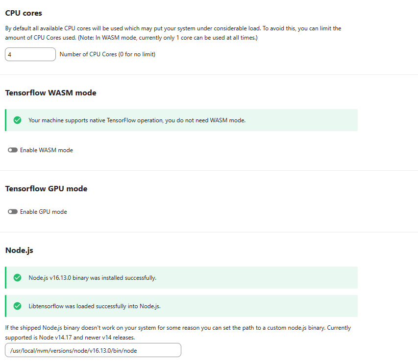
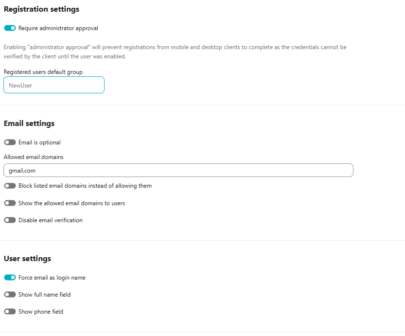
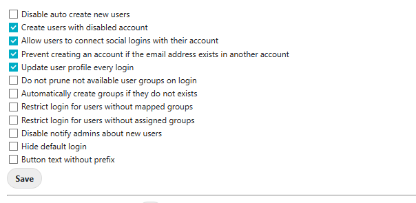
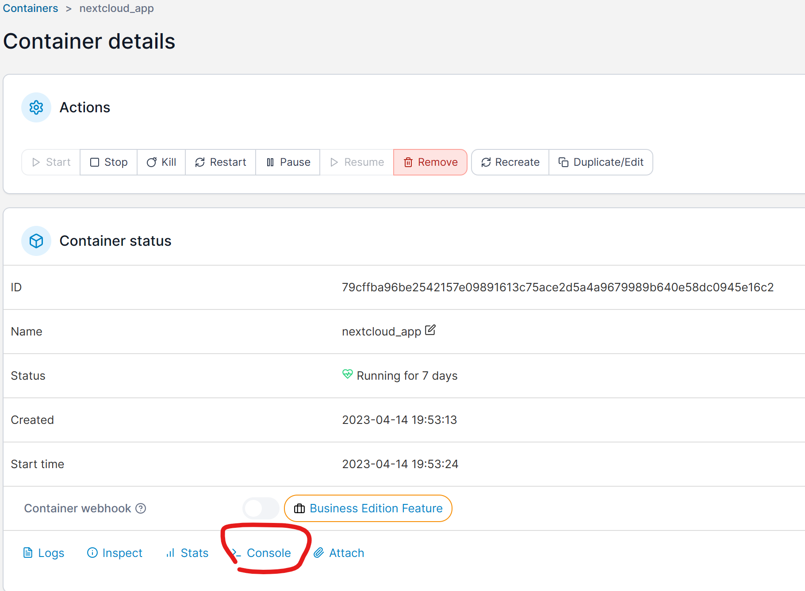
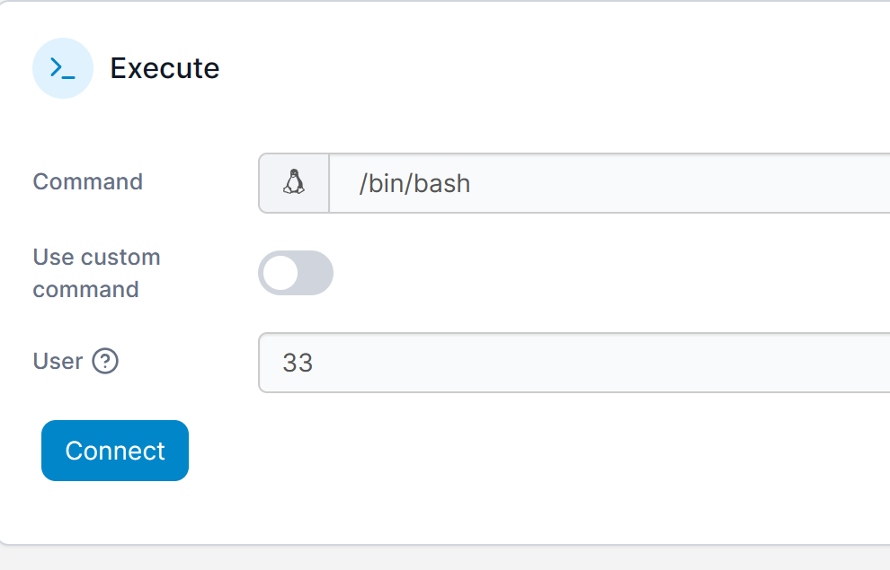
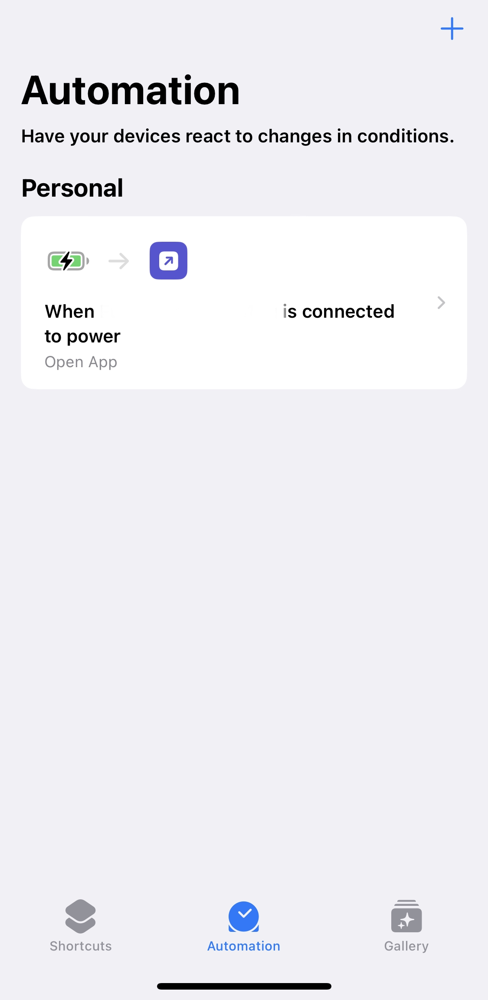

# Nextcloud Docker configuration with Machine Learning Dependencies for plugins
* fork off of [MediaDC docker compose](https://github.com/andrey18106/mediadc-docker-example)
* jump to [getting started](#getting-started)
* nextcloud features: 
  * great opensourced php based service for backing up personal photos and videos
  * has mobile and desktop apps
  * you can setup upload limits for users
  * reason why many choose it is b/c it's multi user and has facial recognition plugins per user
    * there are alternatives that have faster/better file syncing using deltas, but don't have facial recognition, there are some facial recognition docker images you can point to a folder, but you don't have multi user in these cases for now. 
  * despite all this do not forget to run backups (of your database and files)
    * database is less important b/c you can regenerate it
* currently targeting nextcloud 25 since this is the latest version supported by plugins
* container size is ~~2.4~~ 2.0 gb. 
  * some docker container optimizations to decrease size, could tweak nvm node steps to maybe make it smaller
  * This is because I'm not distributing the image, but the build steps
* nextcloud machine learning plugins that will work with current setup, as admin users `+apps` install the app there
  * remember to check downloads section on app/plugin page when deciding on which nextcloud **version** to upgrade to
  * [MediaDC](#mediadc-docker-image-base-example)
  * [Recognize](https://apps.nextcloud.com/apps/recognize)
   * recommended to set less cores to drive cpu usage to less than 100%
   * also node path needs to be set `/usr/local/nvm/versions/node/v16.13.0/bin/node` it'll depend on if you changed the version used
   * 
  * [Face Recognition](https://apps.nextcloud.com/apps/facerecognition)
   * need to console log into nextcloud app and download a module using the command line
   * `./occ face:setup -M 1GB` adding more memory doesn't help, but can make it run slower or completely stop
* additional plugins that I've setup for convenience
  * [Registration](https://apps.nextcloud.com/apps/registration)
    * 
  * [Social Login](https://apps.nextcloud.com/apps/sociallogin)
    * 
  * Memories
  * Preview Generator - make sure that imaginary docker container is setup, need to update config.php with preview settings
     * optimizations
       ```sh
        ./occ config:app:set previewgenerator squareSizes --value="32 256"
        ./occ config:app:set previewgenerator widthSizes  --value="256 384"
        ./occ config:app:set previewgenerator heightSizes --value="256"
        ./occ config:system:set preview_max_x --value 2048
        ./occ config:system:set preview_max_y --value 2048
        ./occ config:system:set jpeg_quality --value 60
        ./occ config:app:set preview jpeg_quality --value="60"
       ```
* plugin notes
  * in this config I do not have calendar and video calls enabled, you can enable these, I'm mostly focused on personal photo and video backups

## Getting Started
1. this is assumming you are using windows see [hardware](#hardware)
1. setup new computer
   * i just named the computer w/e the hardware is `beelink-5800h`, you can then ping it and use shared folders on the network on `beelink-5800h.local`
1. install software
   * vscode
   * git bash
   * remote desktop
     * teamviewer
     * rustdesk (free, but better to self host your own relay)
     * installed both
     * alternatives
       * anydesk, ...
   * resilio if syncing peer to peer folder contents to another folder (a form of backup)
1. create a local only account (not linked to email)
    1. grant local account admin access
    1. remove pin and do auto login (so on restart applications go back online)
      * regedit - `HKEY_LOCAL_MACHINE\SOFTWARE\Microsoft\Windows NT\CurrentVersion\PasswordLess\Device`
      * change **DevicePasswordLessBuildVersion** value to 0
1. On the new local admin account
    * install docker (wsl install)
    * set to auto start up
1. config wsl memory for docker to persist after machine 
    * `code %userprofile%\.wslconfig` (create/open file in vscode) and add these values to configure docker wsl limits
    ```js
    [wsl2]
    kernelCommandLine = "sysctl.vm.max_map_count=524288 sysctl.fs.file-max=131072"
    ```
1. install portainer (for managing apps)
   * `docker volume create portainer_data`
  * `docker run -d -p 8000:8000 -p 9443:9443 --name portainer --restart=always -v /var/run/docker.sock:/var/run/docker.sock -v portainer_data:/data portainer/portainer-ce:latest`
  * install watchtower to auto update docker images (not the custom built nextcloud ones) `docker run -d  --name watchtower --restart=always -v /var/run/docker.sock:/var/run/docker.sock containrrr/watchtower`
  * TODO: research watchtower commands to trigger a docker compose rebuild if base image is updated fron cron job and powershell
    * `docker run --rm -v /var/run/docker.sock:/var/run/docker.sock containrrr/watchtower --run-once nextcloud:25.0-fpm`
    * https://github.com/containrrr/watchtower/issues/1231
1. buy a domain on [namecheap](https://namecheap.pxf.io/m5O5Ke) $15 a year and setup on cloudflare, setup cloudflare tunnel for public urls for your device and use subdomains for your services.
1. setup your custom settings
  1. copy `example.env` to `.env`
      * `xcopy example.env .env`
      * update values as needed
  1. update nginx values `web\nginx.conf` for your public url
  1. replace nextcloud.example.com with your public url
  1. also check `TODO:`s and update values as needed in `docker-compose.yml` 
1. `cd` into this folder
   * run docker compose `docker compose up -d`
   * to rebuild images from scratch or **update** for minor versions run 
      * `docker compose down` then `docker system prune -a` to remove old images
      * `docker compose up -d --build`
        * `docker-compose build --no-cache` build from first level (a prune is usually needed to clear out base image and get latest minor version)
      * `docker-compose run --rm app /bin/bash` directly login if rsync device busy error
1. log into portainer `https://localhost:9443/`
   * locate the nextcloud app container and console log in
      
      * fix permisssions folder permissions as root user
      ```bash
        chown -R www-data:www-data config
        chown -R www-data:www-data apps
        chown -R www-data:www-data custom_apps
        chown -R www-data:www-data data
      ```
   * run `./occ` get the user id needed, and log back in by user id
      
      * you should now be able to run `./occ` commands as the correct user such as scan files added outside and other commands
1. as always test RESTARTING the computer after setup and see if services come back online, if they don't something isn't set up right.
  * maybe multi thread chown https://serverfault.com/questions/378280/fastest-way-to-chown-a-whole-device-xfs

## Running an update
* **double check** nextcloud docker tag to make sure you are on a major nextcloud version and not on latest version as this may cause issues with incompatible plugings
* `docker compose down` then `docker system prune -a` to remove old images
      * `docker compose up -d --build`

## Phone user setup
* download ios app
* log into nextcloud self hosted service
* setup automatic uploads
  1. More > Settings > Auto upload
    * select auto upload folder and create one for your phone or use default
    * select use subfolders
  1. More > Advanced > Chunk size in MB - 20
  1. More > Settings > Auto upload
    * select Upload the whole camera role
    * Note: 
      * wait for it to finish loading before closing the app (should see a count bottom left of files left to upload)
      * subfolders is recommended to be checked
      * if you click stop in the More > Transfers it will not reattempt to upload
      * you can restart your auto uploads from scratch by unselecting and reselecting this option
   1. like most ios apps you can only upload your photos and videos by having the application open, only icloud has full background support
     * the way around this is to set a [shortcut](https://apps.apple.com/us/app/shortcuts/id915249334) to open nextcloud any time you plug it into a charger
      
     * if you have a lot of photos you can open Settings > Display & Brightness > Auto-lock - and set to **never** to upload more photos overnight while charging to catch up
       * DON'T forget to change back to 5 minutes or 30 seconds the following day to not kill your battery

## Hardware
* Note: raspberry pi is not powerful enough for nextcloud with image recognition (maybe raspberry pi 5)
* recommended a mini pc with intel cpu gives benefit of low wattage. intel has better gpu driver support for nextcloud
* [beelink-5800H](https://amzn.to/3KYGctn) (5500U is also fine, just less powerful)
  * has windows 11 pro, can replace with linux such as ubuntu
* bump ram to [64 gb](https://amzn.to/3L0mkpS) (not needed, but nice for handling more users)
  * replacement video https://youtu.be/_iHyF2lAxYo
* [hdmi dummy plugs](https://amzn.to/3MZ6oXv) (for remote desktop)
* NOTE: it's still hard to determine if intel is better than amd cpus b/c of better driver support and quicksync, supposedly amd has support need to figure out how to enable the gpu flags
* external hard drive storage options (depends on your expected use, can replace later)
  * [16 TB](https://amzn.to/43VdIti) 2x
  * [6 TB](https://amzn.to/3GZOvEb) 2x
  * [8 TB ssd](https://amzn.to/43QG7AC), [8 TB hd](https://amzn.to/3oBfrn8)

## MediaDC docker image base example
There is a basic Docker Compose configuration example to use [MediaDC](https://github.com/andrey18106/mediadc) application.

## Advanced
* You need to adjust your Nextcloud app container like in [app/Dockerfile](/mediadc/Dockerfile)
to install required dependencies and re-build your container like in [docker-compose.yml](docker-compose.yml#L24).
* after first docker compose launch some settings, have to be changed in the config.php file.
  * locate `\nextcloud-docker-ml-example_nextcloud` volume should be somewhere in `\\wsl.localhost\docker-desktop-data\data\docker\volumes`
  * `_data\config\config.php`
  * recommend backing up this file on the external drive
* useful [additional services](./additional_services/README.md) to install
* database backup/restore (in git bash)
  * encrypt hard drives in NTFS format using bitlocker. Works on linux and windows make sure to set the remember password flag and test that it auto connects after a restart
  * see powershell scripts in `scripts` folder for backing up database and custom_apps folder
    * use task scheduler to backup db to external drive daily and delete old backups
  * backup (see powershell script for automation)
    *     docker exec -t your-db-container pg_dumpall -c -U postgres > dump_`date +%d-%m-%Y"_"%H_%M_%S`.sql
  * restore `cat your_dump.sql | docker exec -i your-db-container psql -U postgres`
* sofware (maybe docker image) to sync nextcloud db backups and data to 2nd drive
  * currently I run resilio to backup to another external drive on another computer
  * options:
    * discussion: https://superuser.com/questions/65524/how-do-i-synchronise-two-folders-in-real-time-in-windows-7
      * robocopy monitor looks promising, but more 
      * https://synkron.sourceforge.net/, looks less technical and easy to setup
    * docker rsync daily cron job: https://hub.docker.com/r/eeacms/
    * https://superuser.com/questions/497205/can-robocopy-monitor-files-on-a-time-increment-of-less-than-one-minute
      * powershell to handle
    * recommend for **WINDOWS** [DSYNCHRONIZE](http://dimio.altervista.org/eng/) - free and supports realtime sync