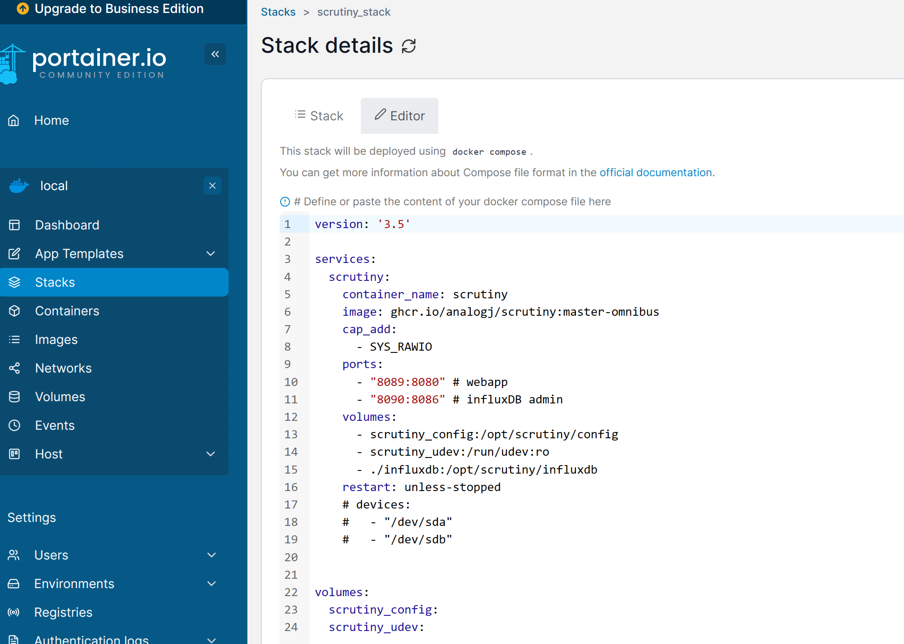

# track drives
* [Back](../README.md)
track drive age

## Setup
* create new stack in portainer and copy `docker-compose.yml` file contents

## windows setup
* https://github.com/AnalogJ/scrutiny/blob/master/docs/INSTALL_MANUAL_WINDOWS.md
* downoad exe, place in C:\Users\Public\Documents\Programs
  * exe from https://github.com/AnalogJ/scrutiny/releases amd64.exe
* add arguments: `run --api-endpoint "http://localhost:8089"`
* start in `C:\Users\Public\Documents\Programs`
* program script: `C:\Users\Public\Documents\Programs\scrutiny-collector-metrics-windows-amd64.exe`
* powershell admin choco install smartmontools
* influx
  * user: admin
  * password: password12345
  * see defaults in https://github.com/AnalogJ/scrutiny/blob/master/webapp/backend/pkg/config/config.go#L49-L51
* in volume config add `scrutiny.yml` modify discord notification, restart container
* test notification in git bash `curl --request POST --url http://localhost:8089/api/health/notify`